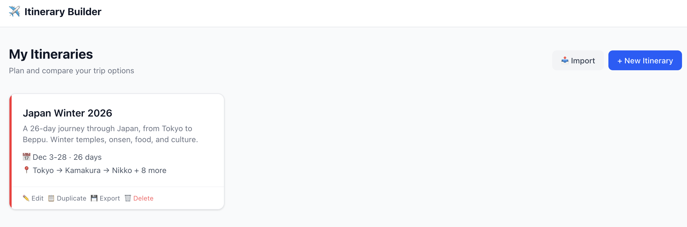
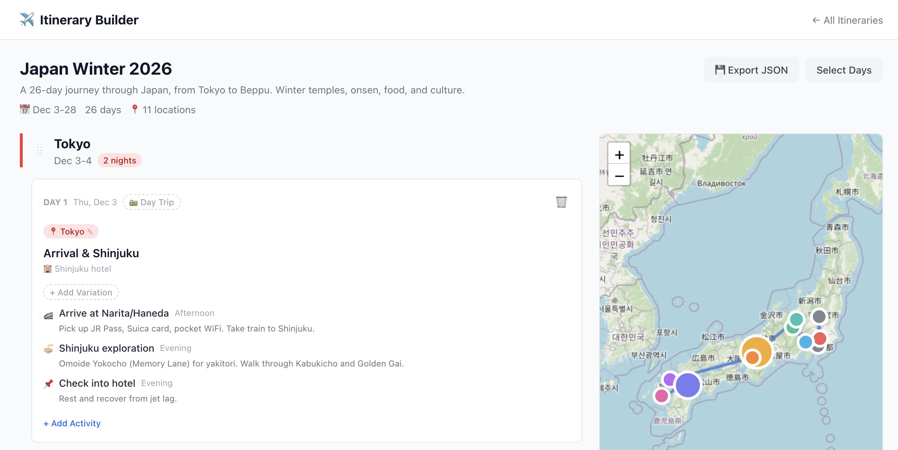
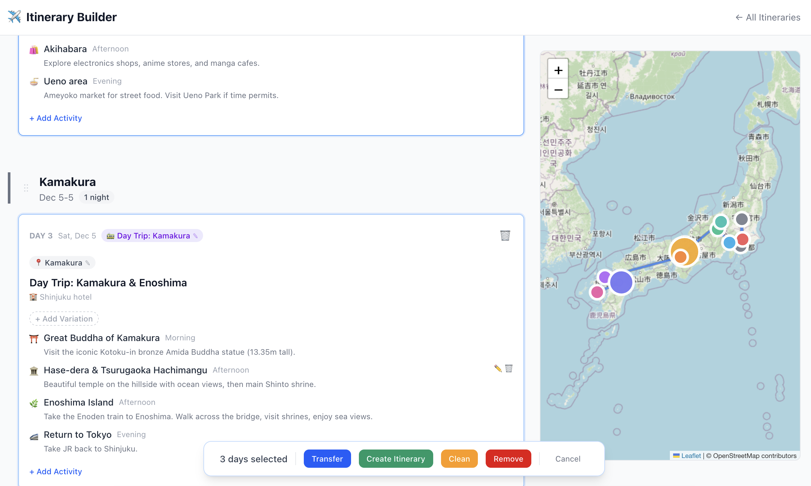

<p align="center">
  
</p>

<h1 align="center">Itinerary Builder</h1>

<p align="center">
  A visual trip planner for building, comparing, and managing travel itineraries with an interactive map.
</p>

<p align="center">
  <strong>Vue 3</strong> &middot; <strong>TypeScript</strong> &middot; <strong>Pinia</strong> &middot; <strong>Leaflet</strong> &middot; <strong>Tailwind CSS v4</strong> &middot; <strong>Vite</strong>
</p>

---

## Features

**Itinerary Management**
- Create, duplicate, import/export itineraries as JSON
- Add single or multiple days with location presets or custom coordinates
- Drag-and-drop to reorder location blocks with automatic date recalculation

**Day Planning**
- Organize activities by time of day (morning, afternoon, evening, all-day)
- Categorize activities (sightseeing, food, transport, culture, onsen, etc.)
- Mark days as day trips to nearby destinations

**Variations**
- Add alternative plans for any day as variations
- Transfer days between itineraries (overlapping dates become variations)
- Promote a variation to the main plan with one click
- Edit variations inline with full activity management

**Multi-Select Actions**
- Select individual days or shift-click for ranges
- Bulk transfer, remove, clean, or create a new itinerary from selected days

**Interactive Map**
- Route visualization connecting all stops
- Marker size scales with number of nights
- Day trip destinations shown as dashed lines
- Auto-fits to show all locations

<p align="center">
  
</p>

<p align="center">
  
</p>

## Getting Started

```bash
npm install
npm run dev
```

Open [http://localhost:5173/itinerary-builder/](http://localhost:5173/itinerary-builder/) in your browser. A sample itinerary is loaded on first visit.

## Build

```bash
npm run build    # Type-check + production build
npm run preview  # Preview the production build
```

## Data Storage

All data is stored in the browser's `localStorage`. Use the export/import feature to back up or share itineraries as JSON files.

## License

MIT
